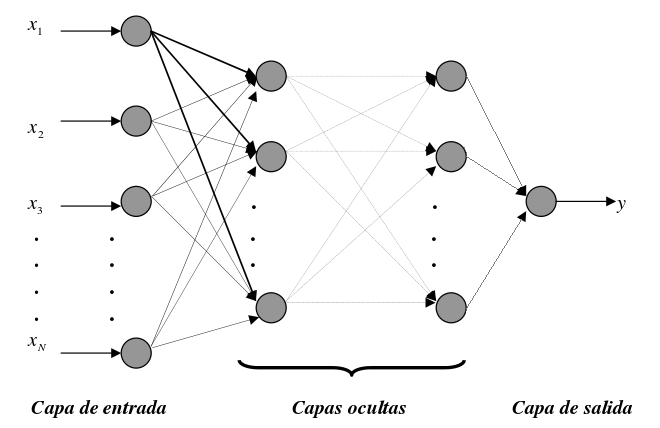

# ANN-MLP-Scikit-learn

Description: Artificial Neural Network - Multi-Layer Perceptron as Regressor using scikit-learn 

Perceptron multicapa configurado para funcionar como regresor:

  
 

Dependences:

* Python - sklearn
* Python - pandas
* Python - NumPy
* Python - Matplolib

Page source:
 https://scikit-learn.org/stable/
