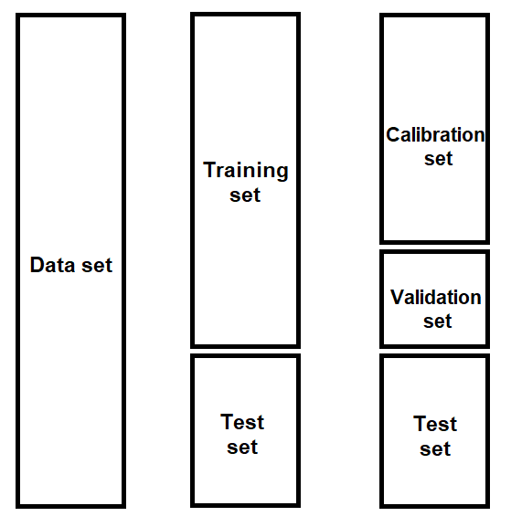

# ANN-MLP-Scikit-learn

Multi-Layer Perceptron (MLP) as Regressor:

  
 

Neural network parameters:

- Number of hidden layers and number of neurons per layers
- Penalty (Alpha)
- Initial learning rate
- Activation function for the hidden layer ('identity', 'logistic', 'tanh', 'relu')
- Learning rate ('constant', 'invscaling', 'adaptive')
- Solver ('lbfgs', 'sgd', 'adam')
- validation_fraction

- Moment of the descending gradient (Momentun) -- if we use the 'sgd' solver

  'lbfgs' is an optimizer in the family of quasi-Newton methods.
  'sgd' refers to stochastic gradient descent.
  'adam' refers to a stochastic gradient-based optimizer proposed by Kingma and Ba (2014)

Note: there are much more parameters, these are considered the most important

More information: https://scikit-learn.org/stable/modules/generated/sklearn.neural_network.MLPRegressor.html

Optimization methods tested to search the hyperparameters space are:

* Exhaustive Grid Search
* Randomized Parameter Optimization

More information: https://scikit-learn.org/stable/modules/grid_search.html

Data splitting scheme:

The data set was divided in other three subsets composed by data for training (calibration and validation), and a posteriori test. Data division presented in the following figure:

  
 

Dependences:

    python - Scikit-learn
    python - Pandas
    python - NumPy
    python - Matplolib
    python - Statsmodels

